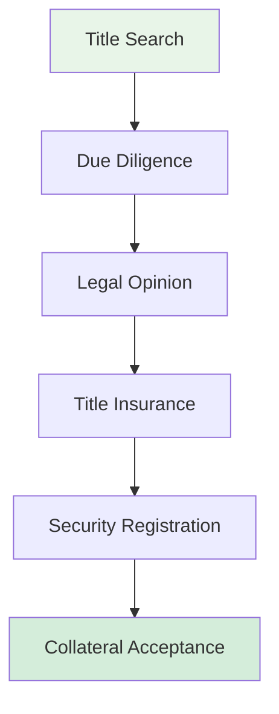
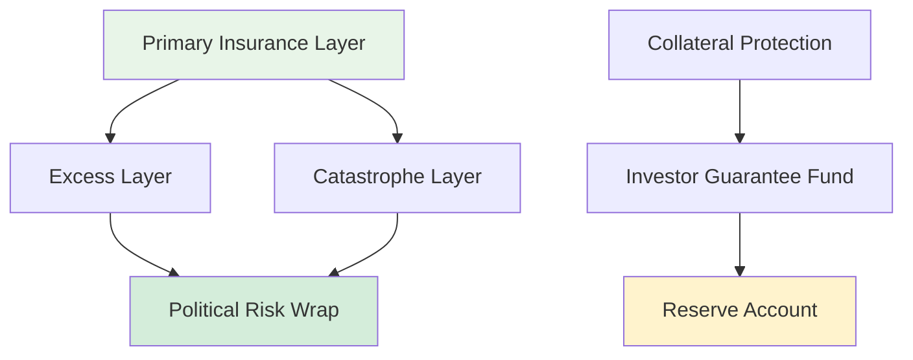
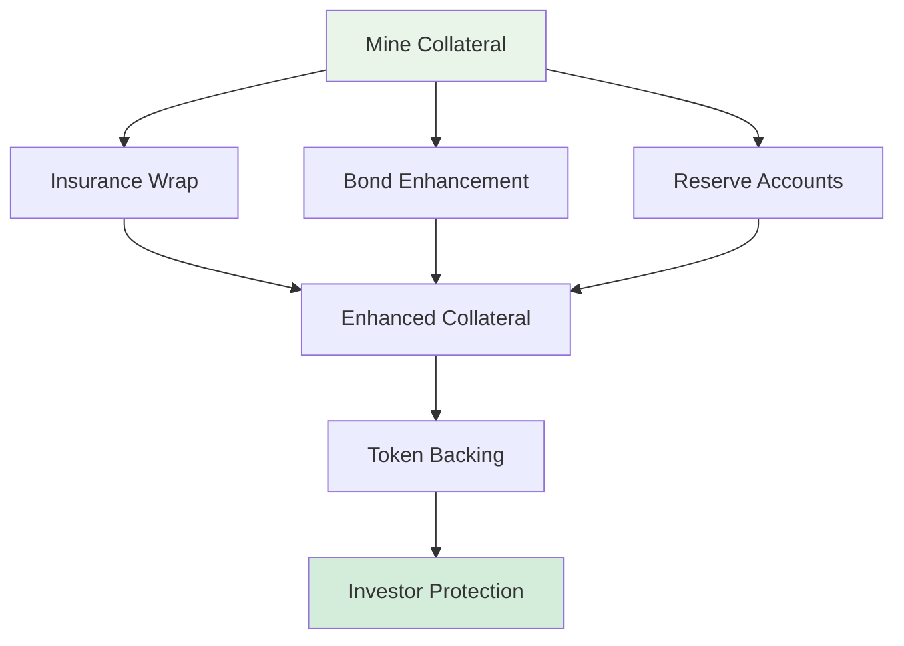
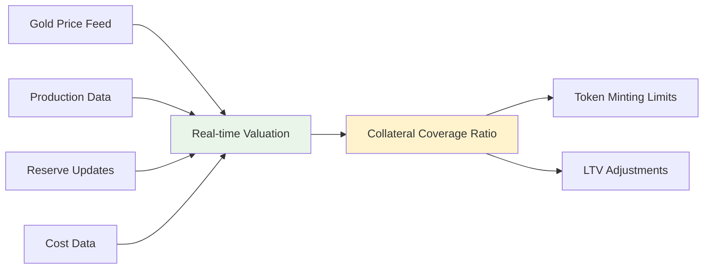
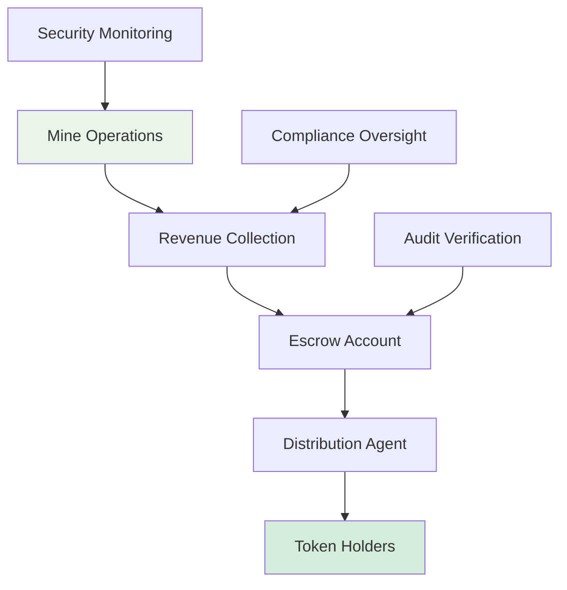
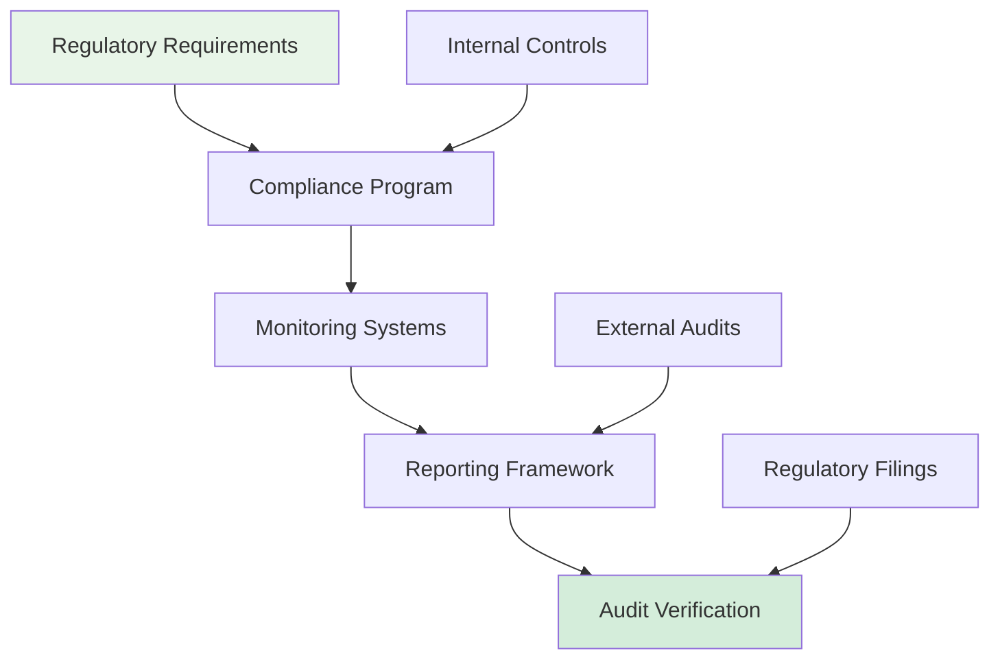
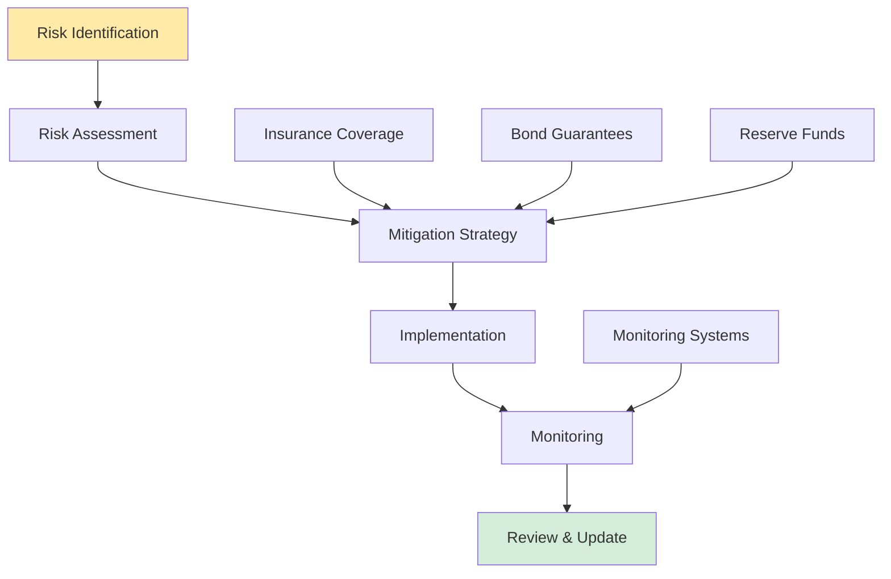

# 🏔️ Gold Mine Collateral Framework

## Executive Summary

This document outlines the comprehensive framework required to use the Quebrada Honda gold mine as collateral for Cardano RWA tokenization. The framework addresses legal, regulatory, insurance, bonding, and operational requirements beyond the existing technical infrastructure.

---

## 📋 Table of Contents

- [🎯 Overview](#-overview)
- [📜 Legal & Ownership Requirements](#-legal--ownership-requirements)
- [🛡️ Insurance Framework](#️-insurance-framework)
- [🔗 Bonding & Guarantee Structures](#-bonding--guarantee-structures)
- [📊 Valuation & Appraisal](#-valuation--appraisal)
- [🏦 Custody & Security](#-custody--security)
- [⚖️ Regulatory Compliance](#️-regulatory-compliance)
- [🏗️ Implementation Roadmap](#️-implementation-roadmap)
- [📈 Risk Assessment](#-risk-assessment)

---

## 🎯 Overview

**Collateral Strategy:** The Quebrada Honda gold mine represents a tangible, income-producing asset that can serve as primary collateral for RWA tokenization. This framework establishes the necessary legal, insurance, and operational structures to enable secure, compliant collateralization.

**Key Objectives:**
- Establish legal ownership and title verification
- Implement comprehensive insurance coverage
- Create bonding structures for investor protection
- Enable transparent valuation and monitoring
- Ensure regulatory compliance across jurisdictions
- Maintain operational continuity and environmental standards

---

## 📜 Legal & Ownership Requirements

### Core Legal Documents

| Document Type | Purpose | Status | Priority |
|---------------|---------|--------|----------|
| **Mining Concession Title** | Legal ownership of mineral rights | Required | Critical |
| **Environmental Permits** | Operational compliance | Required | Critical |
| **Land Use Agreements** | Surface rights and access | Required | Critical |
| **Royalty Agreements** | Revenue sharing arrangements | Required | High |
| **Security Agreement** | Collateral pledge documentation | Required | High |
| **Trust Deed** | Custodian appointment | Required | High |

### Ownership Verification Process

### Additional Legal Requirements

- **International Mining Law Compliance**
- **Cross-border ownership regulations**
- **Tax treaty considerations**
- **Currency exchange controls**
- **Repatriation agreements**

---

## 🛡️ Insurance Framework

### Required Insurance Coverage

#### Primary Coverage Types

| Insurance Type | Coverage Amount | Purpose | Provider Requirements |
|----------------|-----------------|---------|----------------------|
| **Property Insurance** | Full replacement value | Physical assets protection | A-rated insurer |
| **Business Interruption** | 18-24 months revenue | Operational continuity | Mining specialist |
| **Environmental Liability** | Unlimited | Pollution/cleanup costs | Environmental underwriter |
| **Political Risk** | Full collateral value | Sovereign risk protection | Multilateral guarantee |
| **Terrorism & Sabotage** | Full replacement value | Security threats | Specialized underwriter |
| **Directors & Officers** | $10M+ | Management liability | Professional liability insurer |

#### Specialized Mining Insurance

- **Mine Subsidence Insurance**
- **Groundwater Contamination Coverage**
- **Equipment Breakdown Insurance**
- **Cargo Insurance** (for gold transport)
- **Cyber Liability Insurance**

### Insurance Structure

---

## 🔗 Bonding & Guarantee Structures

### Bonding Framework

#### Bond Types Required

| Bond Type | Purpose | Amount | Guarantor |
|-----------|---------|--------|-----------|
| **Performance Bond** | Operational obligations | 10-15% of collateral value | Mining surety company |
| **Environmental Bond** | Cleanup guarantees | Full remediation cost | Environmental surety |
| **Reclamation Bond** | Site restoration | Full restoration cost | Mining authority approved |
| **Payment Bond** | Royalty payments | 6 months revenue | Financial institution |
| **Completion Bond** | Project completion | Remaining capex | Investment bank |

#### Guarantee Structures

- **Bank Guarantees** for operational continuity
- **Insurance-backed Guarantees** for catastrophe events
- **Government Guarantees** for political risk
- **Reserve Fund Guarantees** for maintenance

### Collateral Enhancement

---

## 📊 Valuation & Appraisal

### Valuation Framework

#### Valuation Components

| Component | Methodology | Frequency | Independent Review |
|-----------|-------------|-----------|-------------------|
| **Mineral Reserve Valuation** | NI 43-101 compliant | Annual | Required |
| **Infrastructure Valuation** | Replacement cost | Bi-annual | Required |
| **Revenue Stream Valuation** | DCF analysis | Quarterly | Required |
| **Environmental Liability** | Cost-to-cure | Annual | Required |
| **Going Concern Value** | Market comparable | Annual | Required |

#### Appraisal Requirements

- **NI 43-101 Technical Report** (mandatory)
- **Independent Qualified Person** (QP) certification
- **Reserve audit** by recognized firm
- **Environmental assessment** by certified consultants
- **Market valuation** by mining industry specialists

### Dynamic Valuation System

---

## 🏦 Custody & Security

### Custody Structure

#### Custodian Requirements

| Custodian Type | Responsibilities | Accreditation |
|----------------|------------------|---------------|
| **Mining Custodian** | On-site security & monitoring | ISO 45001 certified |
| **Financial Custodian** | Revenue collection & distribution | Bank regulatory approval |
| **Document Custodian** | Legal document safekeeping | Trust company license |
| **Reserve Custodian** | Maintenance fund management | Institutional trustee |

#### Security Measures

- **24/7 armed security** at mine site
- **Electronic monitoring systems** with off-site backup
- **Access control systems** with biometric verification
- **Revenue escrow accounts** with multi-signature controls
- **Document vault** with dual custody requirements

### Custody Chain

---

## ⚖️ Regulatory Compliance

### Regulatory Framework

#### Primary Regulatory Requirements

| Jurisdiction | Requirements | Compliance Level |
|--------------|--------------|------------------|
| **Mining Authority** | Operational permits, environmental compliance | Mandatory |
| **Securities Regulator** | Disclosure requirements, investor protection | Mandatory |
| **Tax Authority** | Royalty reporting, withholding taxes | Mandatory |
| **Environmental Agency** | Impact assessments, monitoring | Mandatory |
| **Financial Regulator** | Anti-money laundering, KYC | Mandatory |

#### International Compliance

- **FATF Recommendations** for AML/CTF
- **IOSCO Principles** for securities regulation
- **IFRS Accounting Standards** for financial reporting
- **UN Guiding Principles** for business and human rights

### Compliance Monitoring

---

## 🏗️ Implementation Roadmap

### Phase 1: Foundation (Months 1-3)

#### Critical Path Items

1. **Legal Due Diligence**
   - Title verification and chain of ownership
   - Regulatory compliance assessment
   - Environmental permit validation

2. **Insurance Procurement**
   - Property and business interruption coverage
   - Environmental liability insurance
   - Political risk insurance

3. **Bonding Structure**
   - Performance and reclamation bonds
   - Environmental guarantees
   - Payment security arrangements

4. **Valuation Baseline**
   - NI 43-101 technical report
   - Reserve certification
   - Infrastructure appraisal

### Phase 2: Enhancement (Months 4-6)

#### Advanced Features

1. **Custody Establishment**
   - Security systems implementation
   - Revenue collection mechanisms
   - Document management systems

2. **Monitoring Systems**
   - Real-time production tracking
   - Environmental monitoring
   - Financial performance metrics

3. **Reserve Funds**
   - Maintenance reserve establishment
   - Insurance reserve accounts
   - Contingency funding

### Phase 3: Integration (Months 7-9)

#### Tokenization Integration

1. **Smart Contract Updates**
   - Collateral ratio integration
   - Reserve fund triggers
   - Insurance claim automation

2. **Monitoring Integration**
   - Real-time collateral coverage
   - Automated margin calls
   - Reserve fund management

3. **Reporting Systems**
   - Regulatory reporting automation
   - Investor transparency dashboards
   - Audit trail maintenance

---

## 📈 Risk Assessment

### Risk Categories

#### Operational Risks

| Risk | Mitigation | Impact | Probability |
|------|------------|--------|-------------|
| **Production Shortfall** | Insurance + reserves | High | Medium |
| **Environmental Incident** | Comprehensive coverage | Critical | Low |
| **Security Breach** | Armed security + monitoring | High | Low |
| **Regulatory Changes** | Compliance monitoring | Medium | Medium |
| **Market Price Volatility** | Diversification + hedging | Medium | High |

#### Financial Risks

| Risk | Mitigation | Impact | Probability |
|------|------------|--------|-------------|
| **Collateral Depreciation** | Regular revaluation | High | Medium |
| **Liquidity Issues** | Reserve funds | Medium | Low |
| **Counterparty Risk** | Diversified providers | Medium | Low |
| **Currency Fluctuation** | Hedging strategies | Medium | High |
| **Interest Rate Changes** | Fixed rate instruments | Low | Medium |

### Risk Mitigation Framework

---

## 📋 Summary: What You Need Beyond Current Infrastructure

### ✅ What You Already Have

- Technical tokenization platform (QH-R1)
- Basic legal documentation
- Operational mining infrastructure
- Initial compliance framework

### 🔴 What You Need to Add

#### Immediate Requirements (Phase 1)

1. **Insurance Coverage**
   - Property & business interruption insurance
   - Environmental liability insurance
   - Political risk insurance

2. **Bonding Structure**
   - Performance bonds (10-15% of collateral value)
   - Environmental reclamation bonds
   - Payment guarantee bonds

3. **Professional Services**
   - NI 43-101 qualified person for valuation
   - Mining surety company for bonds
   - Environmental consultants
   - Legal counsel specializing in mining finance

4. **Custody Arrangements**
   - Licensed custodian for documents
   - Escrow arrangements for revenues
   - Security systems upgrade

#### Medium-term Requirements (Phase 2)

1. **Enhanced Monitoring**
   - Real-time production tracking
   - Environmental monitoring systems
   - Financial performance dashboards

2. **Reserve Funds**
   - Maintenance reserve (6-12 months)
   - Insurance deductible reserves
   - Contingency funds

3. **Regulatory Compliance**
   - Ongoing compliance monitoring
   - Regular reporting systems
   - Audit preparation

### 💰 Estimated Costs

| Category | Estimated Cost | Timeline |
|----------|----------------|----------|
| **Insurance Premiums** | $500K - $1M annually | Ongoing |
| **Bonding Costs** | $200K - $500K | One-time + annual |
| **Professional Services** | $300K - $600K | Phase 1 |
| **Security & Monitoring** | $150K - $300K | One-time + annual |
| **Legal & Compliance** | $200K - $400K | Ongoing |
| **Reserve Funds** | $1M - $2M | Phase 2 |

### 🎯 Next Steps

1. **Engage Professional Advisors**
   - Mining finance attorneys
   - Insurance brokers specializing in mining
   - NI 43-101 qualified consultants

2. **Conduct Due Diligence**
   - Title verification
   - Environmental assessment
   - Reserve audit

3. **Establish Insurance Coverage**
   - Property insurance procurement
   - Environmental liability insurance
   - Political risk protection

4. **Implement Bonding Structure**
   - Performance bond procurement
   - Reclamation bond establishment
   - Guarantee arrangements

This framework provides the foundation for using your gold mine as robust collateral for Cardano RWA tokenization, ensuring investor protection and regulatory compliance.

## 📜 Legal & Ownership Requirements

### Core Legal Documents

| Document Type | Purpose | Status | Priority |
|---------------|---------|--------|----------|
| **Mining Concession Title** | Legal ownership of mineral rights | Required | Critical |
| **Environmental Permits** | Operational compliance | Required | Critical |
| **Land Use Agreements** | Surface rights and access | Required | Critical |
| **Royalty Agreements** | Revenue sharing arrangements | Required | High |
| **Security Agreement** | Collateral pledge documentation | Required | High |
| **Trust Deed** | Custodian appointment | Required | High |

### Ownership Verification Process

### Additional Legal Requirements

- **International Mining Law Compliance**
- **Cross-border ownership regulations**
- **Tax treaty considerations**
- **Currency exchange controls**
- **Repatriation agreements**

---

## 🛡️ Insurance Framework

### Required Insurance Coverage

#### Primary Coverage Types

| Insurance Type | Coverage Amount | Purpose | Provider Requirements |
|----------------|-----------------|---------|----------------------|
| **Property Insurance** | Full replacement value | Physical assets protection | A-rated insurer |
| **Business Interruption** | 18-24 months revenue | Operational continuity | Mining specialist |
| **Environmental Liability** | Unlimited | Pollution/cleanup costs | Environmental underwriter |
| **Political Risk** | Full collateral value | Sovereign risk protection | Multilateral guarantee |
| **Terrorism & Sabotage** | Full replacement value | Security threats | Specialized underwriter |
| **Directors & Officers** | $10M+ | Management liability | Professional liability insurer |

#### Specialized Mining Insurance

- **Mine Subsidence Insurance**
- **Groundwater Contamination Coverage**
- **Equipment Breakdown Insurance**
- **Cargo Insurance** (for gold transport)
- **Cyber Liability Insurance**

### Insurance Structure

---

## 🔗 Bonding & Guarantee Structures

### Bonding Framework

#### Bond Types Required

| Bond Type | Purpose | Amount | Guarantor |
|-----------|---------|--------|-----------|
| **Performance Bond** | Operational obligations | 10-15% of collateral value | Mining surety company |
| **Environmental Bond** | Cleanup guarantees | Full remediation cost | Environmental surety |
| **Reclamation Bond** | Site restoration | Full restoration cost | Mining authority approved |
| **Payment Bond** | Royalty payments | 6 months revenue | Financial institution |
| **Completion Bond** | Project completion | Remaining capex | Investment bank |

#### Guarantee Structures

- **Bank Guarantees** for operational continuity
- **Insurance-backed Guarantees** for catastrophe events
- **Government Guarantees** for political risk
- **Reserve Fund Guarantees** for maintenance

### Collateral Enhancement

---

## 📊 Valuation & Appraisal

### Valuation Framework

#### Valuation Components

| Component | Methodology | Frequency | Independent Review |
|-----------|-------------|-----------|-------------------|
| **Mineral Reserve Valuation** | NI 43-101 compliant | Annual | Required |
| **Infrastructure Valuation** | Replacement cost | Bi-annual | Required |
| **Revenue Stream Valuation** | DCF analysis | Quarterly | Required |
| **Environmental Liability** | Cost-to-cure | Annual | Required |
| **Going Concern Value** | Market comparable | Annual | Required |

#### Appraisal Requirements

- **NI 43-101 Technical Report** (mandatory)
- **Independent Qualified Person** (QP) certification
- **Reserve audit** by recognized firm
- **Environmental assessment** by certified consultants
- **Market valuation** by mining industry specialists

### Dynamic Valuation System

---

## 🏦 Custody & Security

### Custody Structure

#### Custodian Requirements

| Custodian Type | Responsibilities | Accreditation |
|----------------|------------------|---------------|
| **Mining Custodian** | On-site security & monitoring | ISO 45001 certified |
| **Financial Custodian** | Revenue collection & distribution | Bank regulatory approval |
| **Document Custodian** | Legal document safekeeping | Trust company license |
| **Reserve Custodian** | Maintenance fund management | Institutional trustee |

#### Security Measures

- **24/7 armed security** at mine site
- **Electronic monitoring systems** with off-site backup
- **Access control systems** with biometric verification
- **Revenue escrow accounts** with multi-signature controls
- **Document vault** with dual custody requirements

### Custody Chain

---

## ⚖️ Regulatory Compliance

### Regulatory Framework

#### Primary Regulatory Requirements

| Jurisdiction | Requirements | Compliance Level |
|--------------|--------------|------------------|
| **Mining Authority** | Operational permits, environmental compliance | Mandatory |
| **Securities Regulator** | Disclosure requirements, investor protection | Mandatory |
| **Tax Authority** | Royalty reporting, withholding taxes | Mandatory |
| **Environmental Agency** | Impact assessments, monitoring | Mandatory |
| **Financial Regulator** | Anti-money laundering, KYC | Mandatory |

#### International Compliance

- **FATF Recommendations** for AML/CTF
- **IOSCO Principles** for securities regulation
- **IFRS Accounting Standards** for financial reporting
- **UN Guiding Principles** for business and human rights

### Compliance Monitoring

---

## 🏗️ Implementation Roadmap

### Phase 1: Foundation (Months 1-3)

#### Critical Path Items

1. **Legal Due Diligence**
   - Title verification and chain of ownership
   - Regulatory compliance assessment
   - Environmental permit validation

2. **Insurance Procurement**
   - Property and business interruption coverage
   - Environmental liability insurance
   - Political risk insurance

3. **Bonding Structure**
   - Performance and reclamation bonds
   - Environmental guarantees
   - Payment security arrangements

4. **Valuation Baseline**
   - NI 43-101 technical report
   - Reserve certification
   - Infrastructure appraisal

### Phase 2: Enhancement (Months 4-6)

#### Advanced Features

1. **Custody Establishment**
   - Security systems implementation
   - Revenue collection mechanisms
   - Document management systems

2. **Monitoring Systems**
   - Real-time production tracking
   - Environmental monitoring
   - Financial performance metrics

3. **Reserve Funds**
   - Maintenance reserve establishment
   - Insurance reserve accounts
   - Contingency funding

### Phase 3: Integration (Months 7-9)

#### Tokenization Integration

1. **Smart Contract Updates**
   - Collateral ratio integration
   - Reserve fund triggers
   - Insurance claim automation

2. **Monitoring Integration**
   - Real-time collateral coverage
   - Automated margin calls
   - Reserve fund management

3. **Reporting Systems**
   - Regulatory reporting automation
   - Investor transparency dashboards
   - Audit trail maintenance

---

## 📈 Risk Assessment

### Risk Categories

#### Operational Risks

| Risk | Mitigation | Impact | Probability |
|------|------------|--------|-------------|
| **Production Shortfall** | Insurance + reserves | High | Medium |
| **Environmental Incident** | Comprehensive coverage | Critical | Low |
| **Security Breach** | Armed security + monitoring | High | Low |
| **Regulatory Changes** | Compliance monitoring | Medium | Medium |
| **Market Price Volatility** | Diversification + hedging | Medium | High |

#### Financial Risks

| Risk | Mitigation | Impact | Probability |
|------|------------|--------|-------------|
| **Collateral Depreciation** | Regular revaluation | High | Medium |
| **Liquidity Issues** | Reserve funds | Medium | Low |
| **Counterparty Risk** | Diversified providers | Medium | Low |
| **Currency Fluctuation** | Hedging strategies | Medium | High |
| **Interest Rate Changes** | Fixed rate instruments | Low | Medium |

### Risk Mitigation Framework

---

## 📋 Summary: What You Need Beyond Current Infrastructure

### ✅ What You Already Have
- Technical tokenization platform (QH-R1)
- Basic legal documentation
- Operational mining infrastructure
- Initial compliance framework

### 🔴 What You Need to Add

#### Immediate Requirements (Phase 1)

1. **Insurance Coverage**
   - Property & business interruption insurance
   - Environmental liability insurance
   - Political risk insurance

2. **Bonding Structure**
   - Performance bonds (10-15% of collateral value)
   - Environmental reclamation bonds
   - Payment guarantee bonds

3. **Professional Services**
   - NI 43-101 qualified person for valuation
   - Mining surety company for bonds
   - Environmental consultants
   - Legal counsel specializing in mining finance

4. **Custody Arrangements**
   - Licensed custodian for documents
   - Escrow arrangements for revenues
   - Security systems upgrade

#### Medium-term Requirements (Phase 2)

1. **Enhanced Monitoring**
   - Real-time production tracking
   - Environmental monitoring systems
   - Financial performance dashboards

2. **Reserve Funds**
   - Maintenance reserve (6-12 months)
   - Insurance deductible reserves
   - Contingency funds

3. **Regulatory Compliance**
   - Ongoing compliance monitoring
   - Regular reporting systems
   - Audit preparation

### 💰 Estimated Costs

| Category | Estimated Cost | Timeline |
|----------|----------------|----------|
| **Insurance Premiums** | $500K - $1M annually | Ongoing |
| **Bonding Costs** | $200K - $500K | One-time + annual |
| **Professional Services** | $300K - $600K | Phase 1 |
| **Security & Monitoring** | $150K - $300K | One-time + annual |
| **Legal & Compliance** | $200K - $400K | Ongoing |
| **Reserve Funds** | $1M - $2M | Phase 2 |

### 🎯 Next Steps

1. **Engage Professional Advisors**
   - Mining finance attorneys
   - Insurance brokers specializing in mining
   - NI 43-101 qualified consultants

2. **Conduct Due Diligence**
   - Title verification
   - Environmental assessment
   - Reserve audit

3. **Establish Insurance Coverage**
   - Property insurance procurement
   - Environmental liability coverage
   - Political risk protection

4. **Implement Bonding Structure**
   - Performance bond procurement
   - Reclamation bond establishment
   - Guarantee arrangements

This framework provides the foundation for using your gold mine as robust collateral for Cardano RWA tokenization, ensuring investor protection and regulatory compliance.