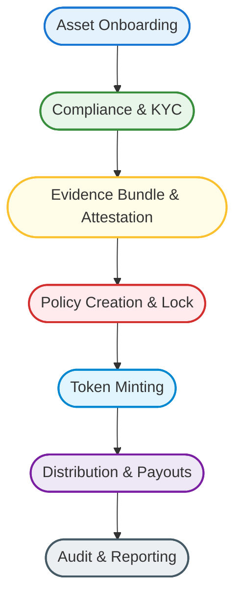
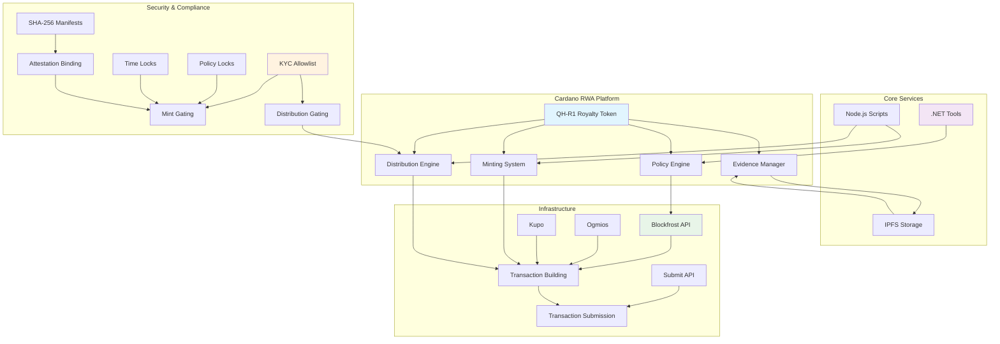
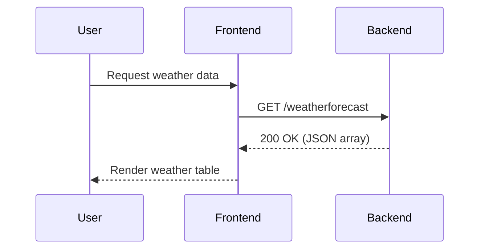

# Cardano RWA Tokenization Platform

---

## 📈 Third-Party Appraisal & Rebuild Overview

**Independent Appraisal (2025):**

The Cardano RWA Tokenization Platform represents a state-of-the-art, modular solution for real-world asset (RWA) tokenization on the Cardano blockchain. Following a comprehensive rebuild, the platform now exemplifies best practices in developer experience, compliance, automation, and extensibility. The architecture integrates .NET (Blazor, ASP.NET Core), TypeScript/Node.js, Docker, and Cardano-native protocols, providing a robust foundation for both institutional and community-driven asset issuance.

**Rebuild & Modernization:**

- The 2025 rebuild introduced:
    - Automated onboarding and local development via Docker Compose and a one-command setup script.
    - Integrated Postgres and IPFS services for persistent, decentralized storage.
    - Full OpenAPI documentation and sequence diagrams for API clarity.
    - Enhanced compliance, audit, and security modules (KYC, allowlisting, evidence bundles).
    - Streamlined developer onboarding, secrets management, and monitoring (Prometheus, Grafana).

**Platform Capabilities:**

- End-to-end asset lifecycle: onboarding, compliance, issuance, distribution, and audit.
- Multi-asset support: royalty tokens, commodities, and custom Cardano-native assets.
- Regulatory alignment: NI 43-101, audit trails, and cryptographic evidence.
- Zero-trust architecture: air-gapped signing, cold storage, and cryptographic attestations.
- Developer-first: modern SDKs, VS Code automation, and comprehensive documentation.

**Future Value & Roadmap:**

The platform is positioned for significant future value:

- **Scalability:** Modular design enables rapid onboarding of new asset types and regulatory regimes.
- **Ecosystem Integration:** Ready for DeFi, DEX, and cross-chain bridges as Cardano and partner protocols evolve.
- **Compliance Automation:** Extensible compliance engine supports evolving global standards.
- **Enterprise Adoption:** Meets institutional requirements for security, audit, and transparency.
- **Community Growth:** Open-source, with clear contribution guidelines and developer tooling.

**Summary:**

The Cardano RWA Tokenization Platform stands as a reference implementation for secure, compliant, and scalable RWA tokenization. Its recent rebuild ensures it is future-proof, developer-friendly, and ready for both enterprise and community adoption. Ongoing enhancements and a clear roadmap position it as a leader in the Cardano and broader blockchain asset tokenization space.

---

<p align="center">
    
</p>

<p align="center">
    
    
    
    
    
</p>


    end

    subgraph "Security & Compliance"
        I[KYC/Allowlist]:::sec --> B
        J[Evidence Bundle]:::sec --> E
        K[Audit Trail]:::sec --> D
    end

    classDef front fill:#e3f2fd,stroke:#1976d2,stroke-width:2px;
    classDef api fill:#ede7f6,stroke:#7b1fa2,stroke-width:2px;
    classDef engine fill:#fffde7,stroke:#fbc02d,stroke-width:2px;
    classDef chain fill:#e8f5e9,stroke:#388e3c,stroke-width:2px;
    classDef ipfs fill:#e1f5fe,stroke:#0288d1,stroke-width:2px;
    classDef infra fill:#f3e5f5,stroke:#512bd4,stroke-width:2px;
    classDef sec fill:#ffccbc,stroke:#d84315,stroke-width:2px;
```

**Component Overview:**

- **Frontend**: Blazor/.NET web app for user and admin operations
- **API**: ASP.NET Core backend for orchestration and compliance
- **Tokenization Engine**: TypeScript/Node.js for Cardano asset logic
- **Blockchain**: Cardano mainnet/preprod for native asset issuance
- **IPFS**: Decentralized storage for evidence and audit bundles
- **Infra**: Ogmios, Kupo, Blockfrost for Cardano node access
- **Security**: KYC, allowlisting, audit, and compliance modules

## 📊 Project Overview

**What is Cardano RWA?**

Cardano RWA is a modular, open-source platform for tokenizing real-world assets (RWA) on Cardano. It supports the full asset lifecycle: onboarding, compliance, issuance, distribution, and audit. The platform is designed for both technical and business stakeholders, with a focus on security, transparency, and regulatory alignment.

**Key Features:**

- 🌐 **Multi-asset support**: Royalty tokens, commodities, and more
- 🛡️ **Compliance-first**: Evidence bundles, KYC, and audit trails
- ⚡ **Automated flows**: Policy creation, attestation, minting, and payouts
- 🔗 **Interoperable**: .NET, TypeScript, Docker, and Cardano-native standards

## 🚀 Quick Start

### Prerequisites

- Docker & Docker Compose
- .NET SDK 9.0+
- Git
- 8GB+ RAM

### One-Command Setup

```bash
# Clone and start
git clone https://github.com/Trustiva7777/dotnet-codespaces.git
cd dotnet-codespaces
./scripts/onboard.sh
```

**Access Services:**

- **Frontend:** http://localhost:8081
- **Backend API:** http://localhost:8080
- **Swagger Docs:** http://localhost:8080/swagger
- **Grafana:** http://localhost:3000 (admin/admin)
- **Prometheus:** http://localhost:9090

## 📚 Documentation

| Document | Purpose |
|----------|---------|
| **[DEVELOPER.md](./DEVELOPER.md)** | Comprehensive developer guide, service setup, troubleshooting |
| **[API.md](./API.md)** | REST API endpoints, OpenAPI specs, integration examples |
| **[ARCHITECTURE.md](./ARCHITECTURE.md)** | System diagrams, data flows, scalability patterns |

## 🏗️ Local Development Services

The platform includes a complete Docker Compose environment:

### Core Services

| Service | Port | Purpose |
|---------|------|---------|
| **Frontend** | 8081 | Blazor Server UI |
| **Backend** | 8080 | ASP.NET Core REST API |
| **PostgreSQL** | 5432 | Primary database |
| **IPFS** | 5001, 8080 | Decentralized file storage |

### Blockchain Services

| Service | Port | Purpose |
|---------|------|---------|
| **Cardano Node** | 3001 | Cardano blockchain (preview testnet) |
| **Ogmios** | 1337 | Blockchain query API |

### Monitoring

| Service | Port | Purpose |
|---------|------|---------|
| **Prometheus** | 9090 | Metrics collection |
| **Grafana** | 3000 | Metrics visualization |

### Starting Services

```bash
# Start all services
docker-compose up -d

# View logs
docker-compose logs -f

# Stop all services
docker-compose down

# View service status
docker-compose ps
```

## 🔧 Common Development Tasks

### Building Locally

```bash
# Build backend
dotnet build SampleApp/BackEnd/BackEnd.csproj

# Build frontend
dotnet build SampleApp/FrontEnd/FrontEnd.csproj

# Run tests
dotnet test
```

### Database Management

```bash
# Connect to PostgreSQL
docker-compose exec db psql -U postgres -d sampledb

# Create migrations
dotnet ef migrations add MigrationName

# Update database
dotnet ef database update
```

### Secrets & Environment Variables

Secrets are managed via `.env` file (never commit to Git):

```bash
# Copy example
cp .env.example .env

# Edit your local secrets
nano .env
```

For production, use:
- AWS Secrets Manager
- Azure Key Vault
- HashiCorp Vault

## 🔐 Security

### Features

- JWT-based authentication
- Role-based access control (RBAC)
- Input validation & sanitization
- SQL injection prevention
- TLS/HTTPS encryption
- Audit logging
- Rate limiting

### Best Practices

1. Never commit `.env` files with real secrets
2. Rotate credentials regularly
3. Use HTTPS in production
4. Enable MFA for admin accounts
5. Review audit logs regularly
6. Keep dependencies updated

## 📊 Monitoring & Observability

### Metrics

Monitor system health via Grafana dashboards:

- Request rates and latency
- Database performance
- Container resource usage
- Blockchain sync status
- IPFS performance

### Health Checks

```bash
# Backend
curl http://localhost:8080/health

# Frontend
curl http://localhost:8081/health

# Database
docker-compose exec db pg_isready

# IPFS
curl http://localhost:5001/api/v0/id

# Cardano
curl http://localhost:1337/health
```

## 🚢 Deployment

### Production Deployment

The platform can be deployed to:

- **AWS:** ECS, RDS, ALB, CloudWatch
- **Azure:** App Service, SQL Database, Application Insights
- **Kubernetes:** Helm charts available
- **Docker:** Docker Swarm or Docker Host

### Deployment Guide

For detailed deployment instructions:
1. Review [DEPLOYMENT.md](./cardano-rwa-qh/DEPLOY.md) (if available)
2. Configure environment for your target platform
3. Set up SSL certificates
4. Configure backups and disaster recovery
5. Deploy monitoring and alerting

## 🤝 Contributing

We welcome contributions! Please:

1. Fork the repository
2. Create a feature branch (`git checkout -b feature/amazing-feature`)
3. Commit your changes (`git commit -m 'Add amazing feature'`)
4. Push to the branch (`git push origin feature/amazing-feature`)
5. Open a Pull Request

### Development Workflow

```bash
# 1. Run onboarding
./scripts/onboard.sh

# 2. Create feature branch
git checkout -b feature/my-feature

# 3. Make changes and test locally
dotnet build
dotnet test

# 4. Commit and push
git commit -am 'Describe your changes'
git push origin feature/my-feature

# 5. Open PR on GitHub
```

## 📖 Learning Resources

### Cardano

- [Official Cardano Documentation](https://docs.cardano.org)
- [Cardano Developers](https://developers.cardano.org)
- [Ogmios Documentation](https://ogmios.dev)
- [Blockfrost API](https://blockfrost.io)

### .NET & Blazor

- [ASP.NET Core Documentation](https://docs.microsoft.com/aspnet/core)
- [Blazor Documentation](https://docs.microsoft.com/aspnet/core/blazor)
- [C# Guide](https://docs.microsoft.com/dotnet/csharp)

### Infrastructure

- [Docker Documentation](https://docs.docker.com)
- [Docker Compose Guide](https://docs.docker.com/compose)
- [PostgreSQL Documentation](https://www.postgresql.org/docs)
- [IPFS Documentation](https://docs.ipfs.io)

## 🐛 Troubleshooting

### Services Won't Start

```bash
# Check Docker
docker ps

# Rebuild images
docker-compose build --no-cache

# View full logs
docker-compose logs
```

### Database Connection Errors

```bash
# Test connection
docker-compose exec db psql -U postgres -d sampledb -c "SELECT 1"

# Check environment
docker-compose config | grep POSTGRES
```

### IPFS Not Responding

```bash
# Check IPFS status
docker-compose exec ipfs ipfs swarm peers

# Reset IPFS (WARNING: Deletes data)
docker volume rm dotnet-codespaces_ipfs-data
docker-compose up -d ipfs
```

See [DEVELOPER.md](./DEVELOPER.md) for more troubleshooting tips.

## 📋 Compliance & Audit

The platform includes:

- ✅ KYC/Allowlist verification
- ✅ Evidence bundle storage
- ✅ Immutable audit trails
- ✅ Regulatory reporting (NI 43-101)
- ✅ Transaction attestation

## 📄 License

This project is licensed under the MIT License - see [LICENSE](LICENSE) file for details.

## 🙋 Support

- **Documentation:** See [DEVELOPER.md](./DEVELOPER.md) and [API.md](./API.md)
- **Issues:** Report on [GitHub Issues](https://github.com/Trustiva7777/dotnet-codespaces/issues)
- **Discussions:** Join our [Discord](https://discord.gg/cardano-rwa)

## 🎯 Roadmap

### Current Release (v1.0)
- ✅ Multi-asset support
- ✅ Docker-based local development
- ✅ IPFS integration
- ✅ Cardano blockchain support
- ✅ Monitoring & observability
- ✅ Comprehensive documentation

### Planned Features (v2.0)
- [ ] Advanced KYC/AML engine
- [ ] Secondary market support
- [ ] DeFi integrations
- [ ] Cross-chain bridges
- [ ] Mobile app
- [ ] Advanced analytics

## 🙏 Acknowledgments

Built with ❤️ on Cardano

**Technology Stack:**
- Cardano Blockchain
- .NET & Blazor
- TypeScript/Node.js
- Docker & Docker Compose
- PostgreSQL
- IPFS
- Prometheus & Grafana

---

**Last Updated:** November 2025
**Version:** 1.0.0
**Status:** Active Development ✅
## 🔗 RWA Tokenization Flow



**Tokenization Steps:**

- **Onboarding**: Asset due diligence, legal, and technical checks
- **Compliance**: KYC/AML, regulatory, and evidence collection
- **Attestation**: IPFS-pinned bundles, cryptographic manifest, and audit
- **Policy**: Multi-sig, time-locked, and compliance-bound policy creation
- **Minting**: Secure, controlled issuance of Cardano native tokens
- **Distribution**: Automated, pro-rata payouts and investor reporting
- **Audit**: Immutable records, compliance checks, and transparency

## 🏆 Executive Summary

**Cardano RWA Tokenization Platform** delivers a secure, compliant, and scalable solution for tokenizing real-world assets (RWA) on the Cardano blockchain. Designed for institutional and enterprise use, it enables the issuance, management, and distribution of asset-backed tokens—such as mining royalties, commodities, and financial instruments—leveraging Cardano’s robust smart contract and native asset capabilities.

**Highlights:**

- 🔹 **Enterprise-Grade Security**: Multi-signature, time-locked policies, and KYC allowlisting
- 🔹 **Regulatory Compliance**: NI 43-101 technical standards, IPFS-pinned evidence, and audit trails
- 🔹 **Automated Payouts**: Pro-rata ADA distributions, CSV-driven, with transparent reporting
- 🔹 **Zero-Trust Architecture**: Air-gapped signing, cryptographic attestations, and cold storage support
- 🔹 **Developer-First**: .NET and TypeScript SDKs, Dockerized infra, and VS Code task automation

# 📑 Table of Contents

- [🏆 Executive Summary](#executive-summary)
- [📊 Project Overview](#project-overview)
- [🔗 RWA Tokenization Flow](#rwa-tokenization-flow)
- [🏗️ Architecture](#architecture)
- [🚀 Quick Start](#quick-start)
- [🧑‍💻 Local Development with Docker Compose](#local-development-with-docker-compose)
- [🔒 Compliance & Security](#compliance--security)
- [🛠️ Developer Notes](#developer-notes)
- [🤝 Contributing](#-contributing)
- [📄 License](#license)
- [💬 Support](#support)

# 🧑‍💻 Local Development with Docker Compose

### Run the .NET Backend & Frontend in One Command

```
docker compose up --build -d
```

**Services:**

- Backend API: [http://localhost:8080](http://localhost:8080)
- Frontend (Blazor): [http://localhost:8081](http://localhost:8081)

- Postgres: [localhost:5432](localhost:5432) (user: postgres, pass: postgres)
- IPFS: [http://localhost:5001](http://localhost:5001) (API), [http://localhost:8080](http://localhost:8080) (Gateway)
- Prometheus: [http://localhost:9090](http://localhost:9090)
- Grafana: [http://localhost:3000](http://localhost:3000) (default: admin/admin)

You should see the Blazor web app at [http://localhost:8081](http://localhost:8081) and the backend API at [http://localhost:8080/weatherforecast](http://localhost:8080/weatherforecast).


To stop the stack:

```
docker compose down
```

---

## 🚀 Onboarding: One-Command Setup

For a fast, automated local setup, use the onboarding script:

```
./setup.sh
```

This will:
- Create a `.env` file if missing (with default secrets)
- Build and start all services (backend, frontend, Postgres, IPFS, Cardano node, monitoring)
- Print service URLs and credentials

See the script for details and customize as needed.

**Troubleshooting:**

- If you change code, re-run `docker compose up --build -d` to rebuild.
- Ensure ports 8080 and 8081 are not in use by other processes.
- For logs: `docker logs backend` or `docker logs frontend`.
# 🚀 Cardano RWA — Complete Tokenization Platform

<div align="center">


[](https://opensource.org/licenses/MIT)
[](https://nodejs.org/)
[](https://dotnet.microsoft.com/)

*Enterprise-grade Real World Asset tokenization on Cardano blockchain*

[📖 Documentation](#-documentation) • [🚀 Quick Start](#-quick-start) • [🏗️ Architecture](#-architecture) • [🔒 Security](#-security)

</div>

---

## 📋 Table of Contents

- [🎯 Overview](#-overview)
- [📁 Repository Structure](#-repository-structure)
- [🏗️ Architecture](#-architecture)
- [📖 Documentation](#-documentation)
- [🚀 Quick Start](#-quick-start)
- [🔧 Installation](#-installation)
- [💻 Usage](#-usage)
- [🔒 Security](#-security)
- [🧪 Testing](#-testing)
- [🤝 Contributing](#-contributing)
- [📄 License](#-license)
- [🙋 Support](#-support)

---

## 🎯 Overview

<div style="background: linear-gradient(135deg, #667eea 0%, #764ba2 100%); color: white; padding: 20px; border-radius: 10px; margin: 20px 0;">

**Cardano RWA** is a comprehensive Real World Asset tokenization platform built on the Cardano blockchain. This repository contains production-ready solutions for secure, compliant, and transparent tokenization of real-world assets including mining royalties, commodities, and financial instruments.

**Key Components:**
- 🔐 **QH-R1 Royalty Token**: Complete issuance scaffold for mining royalty tokenization
- 🏗️ **Multi-Asset Framework**: Extensible architecture for various RWA types
- 📋 **Regulatory Compliance**: NI 43-101 compliant evidence bundles and attestations
- 🎯 **KYC Integration**: Allowlist-gated minting and distribution controls
- 💰 **Automated Payouts**: Quarterly distribution engines with pro-rata calculations
- 🔍 **Full Transparency**: IPFS-pinned proof bundles with cryptographic integrity

</div>

---

## 📁 Repository Structure

# Cardano RWA — QH-R1 (Quebrada Honda I & II)

This workspace mints and manages the QH-R1 Royalty Token on Cardano:
- Mint / lock a native policy (key-locked + optional time-lock).
- Attach evidence via an IPFS proof bundle (NI 43-101, valuation, corp profile).
- Gate mints & distributions via a KYC allowlist.
- Quarterly payouts: compute per-address royalty amounts from CSV inputs.

## Quick start (offline-first, zero downloads)

1. **Env**

    * Copy `.env.preprod.example` → `.env` (or `.env.mainnet.example` when ready).
    * Set `BLOCKFROST_API_KEY` **or** your own infra endpoints (Ogmios/Kupo/Submit-API) below.

2. **Freeze evidence & inputs**

    * **Proof manifest** → VS Code Task: **"Proofs: build sha256 manifest (.NET)"**
        *Output:* `docs/sha256-manifest.json`
    * **Plan lock** → **"Policy: plan lock slot (.NET)"** (or **with current slot** to compute `beforeSlot`)
        *Output:* `reports/lock_plan.json` (+ `reports/lock_plan.beforeSlot` if current slot was provided)
    * **Allowlist**: Use your CSV/JSON (no pre-hash needed).

3. **Attest issuance (single step)**

    * Task: **"Attestation: policy/lock/proofs (.NET)"**
        Provide: `policyId`, `network` (Preprod/Mainnet), `policy JSON`, optional `beforeSlot`, and your **allowlist file**.
        *Output:* `docs/token/attestation.<Network>.json` (binds policyId, manifest hash, canonical allowlist hash, timing).

4. **Policy create/lock (Preprod first)**

    * If you're using your Node scripts, run those here; otherwise follow your policy JSON + lock flow from the checklist.

5. **Mint (Preprod)**

    * Dry-run your mint. Confirm policy, attestation, and proof bundle CID line up.

6. **Flip to Mainnet**

    * Update `.env` to Mainnet; repeat **Lock/Attest** with final policyId; then mint.

> Want fewer clicks? Use the chain task **"Policy: plan lock → attestation (auto) (.NET)"**. It computes `beforeSlot`, then immediately runs the attestation with the right value injected.

## Game plan and investor pack
- Full phased plan: see `./docs/PLAN_QH_R1.md`
- Evidence bundle template: `./docs/PROOF/qh_r1_proof.bundle.json`
- Term sheet: `./legal/term_sheet_royalty_QH-R1.md`
- Risk factors: `./legal/risk_factors_QH.md`
- Subscription outline: `./legal/subscription_agreement_outline.md`

## Use your own Cardano infra

Bring up Ogmios, Kupo, and Submit-API (sample compose included).

```
OGMIOS_URL=wss://ogmios.yourdomain:1337
KUPO_URL=https://kupo.yourdomain:1442
SUBMIT_API_URL=https://submit.yourdomain:8090   # optional; for POSTing signed CBOR
```

The toolkit prefers Ogmios+Kupo when present; otherwise it falls back to Blockfrost.

## Proofs & attestations (two paths)

* **.NET (recommended here)**

    * **Proofs:** "Proofs: build sha256 manifest (.NET)" → `docs/sha256-manifest.json`
    * **Attest:** "Attestation: policy/lock/proofs (.NET)"
        Accepts **allowlist file directly**; computes canonical SHA-256.

* **Node/TS (optional, on machines with Node)**

    * "Proofs: build sha256 manifest"
    * "Attestation: generate issuance attestation"

See `docs/MAINNET_READINESS_CHECKLIST.md` for an end-to-end preflight.

## Payouts & distributions

1. **Plan**

     * Fill `./docs/qh_r1_payouts_template.csv` (`wallet_address,tokens_held,pro_rata_share,payout_amount_usd`).
     * Task: **"Payouts: plan (.NET)"** → `reports/payout_plan.json` (prints totals)

2. **ADA ledger**

     * Task: **"Payouts: ADA ledger (.NET)"** → prompts USD→ADA `fx`
         *Output:* `reports/ada_ledger.csv` (`wallet_address,ada,lovelace`)

3. **Unsigned tx batches (no chain libs)**

     * Task: **"Distribute: draft ADA tx batches (.NET)"**
         *Output:* `out/tx_batches/tx_batch_*.json` (unsigned plans), `*.inputs.template.json`, `submit_batch_*.curl.sh`, `SUMMARY.json`
     * Move a batch plan to your signer box, build/sign into CBOR, drop back as `tx_batch_001.signed.cbor`, then:

         ```
         bash out/tx_batches/submit_batch_001.curl.sh
         ```

         Set `SUBMIT_API` to your relay if needed.

> USDC distributions are typically off-chain; leave CLI in **plan** mode and use the exported ledger with your payment processor.

### Optional (Node-based distributor)

If you prefer the Node/TS path and have Node inside your environment, you can use the distributor script directly. From the repo root use the VS Code task:

- "Distribute (Node): plan" — runs `pnpm --dir cardano-rwa-qh distribute -- --csv ./docs/qh_r1_payouts_template.csv --mode plan`

This fixes the common error when running `pnpm distribute` at the root (no package.json at the root). The script lives under `cardano-rwa-qh`.

---

## Example (Node script path, optional)

```bash
pnpm install
pnpm dev

# Policy (example deadline)
pnpm policy -- --slot-deadline 99999999

# Prepare + pin proof JSON → get ipfs://CID
pnpm mint -- --ticker "QH-R1" --amount 1000000 --decimals 2 \
    --name "QuebradaHonda-Royalty-Phase1" --doc "ipfs://<CID>"
```

---

## Safety rails (do these every time)

* Recompute a couple of file hashes manually and compare to `docs/sha256-manifest.json`:

    ```
    sha256sum docs/<file>
    ```
* Confirm `attestation.<Network>.json` references:

    * the exact **policyId** you'll lock,
    * the correct **manifest sha256**, and
    * the canonical **allowlist sha256**.
* Tag the repo at mint: commit `attestation.Mainnet.json` and tag that commit.

---

### What changed vs your original text (so you see the deltas)

* Promoted the **.NET tasks** to first-class (no Node required in this container).
* Documented **allowlist-file ingestion** (no manual SHA copying).
* Added **lock→attest chain task** and the new **ADA batch drafts** flow.
* Tightened the order of operations to mirror your CI-ish workflow.

If you want the next sugar layer, I can add a tiny **fee-fitter** for the ADA drafts and a **Signer Helper** template (reads a batch plan, constructs CBOR via `cardano-cli`, signs with a hardware or file key, and emits the digest)—still keeping your "zero random downloads" vibe.

## Wallet generation (local, encrypted)

Use the VS Code task "Wallet: generate (SeedGen, .NET)" to create a 24-word seed, derive Mainnet/Preprod/Preview base addresses, and write:

- `Cardano/Dev/Wallet/mainnet/addr_mainnet.txt`
- `Cardano/Dev/Wallet/preprod/addr_preprod.txt`
- `Cardano/Dev/Wallet/preview/addr_preview.txt`
- `Cardano/Dev/Wallet/pay.xpub`, `stake.xpub`
- `Cardano/Dev/Wallet/*/seed.enc` — AES-256-GCM, PBKDF2-SHA512 200k rounds

Notes:
- The plaintext mnemonic is never written to disk; only `seed.enc` is stored.
- `.gitignore` is updated to exclude `Cardano/Dev/Wallet/` and local draft/ledger outputs. Do not commit secrets.

## Signer Helper (offline sign box)

Use these helper scripts on your signer host (with `cardano-cli` and `jq`):

- Bash: `scripts/signer/build_sign_submit.sh`
- PowerShell: `scripts/signer/build_sign_submit.ps1`

They take a batch plan (`tx_batch_001.json`) and inputs template, build the transaction with auto fee (`--conway-era`), sign with your payment key, write `tx_batch_001.signed.cbor`, and optionally POST to a Submit API.

Quick path:
1) Export a bundle from the dev container:
    - Task: "Signer: export bundle for batch 001"
    - This packages the plan, inputs template, attestation pointer, and a README, plus copies the scripts if present.
2) On signer host:
    - Edit `CHANGE_ADDR.txt` and `NETWORK_FLAG.txt`
    - Run `build_sign_submit.sh` (or `.ps1`) with your key and flags.
3) Submit from signer (`--submit-api`) or copy `*.signed.cbor` back and run the generated `submit_batch_001.curl.sh`.

Notes:
- `--network-flag` is explicit: use `--testnet-magic 1` for preprod (adjust magic to environment) or `--mainnet` for mainnet.
- Metadata label 674 (CIP-20 style) is built from your plan's `auxiliary.label_674`.


```
├── cardano-rwa-qh/           # 🚀 Main RWA Issuance Platform
│   ├── docs/                  # 📖 Complete documentation suite
│   ├── src/                   # 💻 TypeScript/Node.js implementation
│   ├── compliance-policy.json # 📋 Regulatory compliance rules
│   ├── docker-compose.yml     # 🐳 Local Cardano infrastructure
│   └── README.md             # 📄 Detailed platform documentation
├── rwa-suite/                # 🏗️ Multi-asset framework
│   └── chains/
│       └── cardano/          # 🔗 Cardano-specific implementations
├── apps/                     # 📱 Application layer
│   └── midnight-suite/       # 🌙 Midnight protocol integration
├── tools/                    # 🔧 Development and utility tools
├── scripts/                  # 📜 Automation scripts
│   └── signer/               # 🔐 Offline signing utilities
├── SampleApp/               # 💻 .NET development environment
│   ├── FrontEnd/            # 🌐 Blazor web application
│   └── BackEnd/             # ⚙️ ASP.NET Core API
└── .devcontainer/           # 🐳 Development container configuration
```

---

## 🏗️ Architecture



### Core Components

| Component | Location | Technology | Purpose |
|-----------|----------|------------|---------|
| **QH-R1 Platform** | `cardano-rwa-qh/` | TypeScript/.NET | Complete royalty token issuance |
| **Multi-Asset Framework** | `rwa-suite/` | Multi-language | Extensible RWA architecture |
| **Application Layer** | `apps/` | Various | User interfaces and integrations |
| **Development Tools** | `tools/` | Shell/Python | Development utilities |
| **Signing Utilities** | `scripts/signer/` | Bash/PowerShell | Cold storage signing |

---

## 📖 Documentation

<div style="background: #f8f9fa; padding: 20px; border-radius: 8px; margin: 20px 0;">

### � API Documentation (OpenAPI)

The backend API is documented using OpenAPI. See [`openapi.yaml`](./openapi.yaml) for the full specification.

**Sample endpoint:**

- `GET /weatherforecast` — Returns a list of weather forecasts (see OpenAPI spec for schema).

You can visualize the spec using [Swagger Editor](https://editor.swagger.io/) or similar tools.

---

### 🔄 Sequence Diagram: Weather Forecast API



### �📚 Documentation Suite

| Component | Documentation | Location |
|-----------|---------------|----------|
| **QH-R1 Platform** | Complete README | [`cardano-rwa-qh/README.md`](cardano-rwa-qh/README.md) |
| **Investor Brief** | One-pager for investors | [`cardano-rwa-qh/docs/INVESTOR_BRIEF_QH-R1.md`](cardano-rwa-qh/docs/INVESTOR_BRIEF_QH-R1.md) |
| **Technical Reports** | NI 43-101 compliance | [`cardano-rwa-qh/docs/`](cardano-rwa-qh/docs/) |
| **Operational Docs** | Runbooks and procedures | [`cardano-rwa-qh/docs/ops/`](cardano-rwa-qh/docs/ops/) |
| **Security Guide** | Security measures | [`cardano-rwa-qh/README-SAFETY.md`](cardano-rwa-qh/README-SAFETY.md) |
| **Deployment Guide** | Production setup | [`cardano-rwa-qh/DEPLOY.md`](cardano-rwa-qh/DEPLOY.md) |

### 🏗️ Technical Specifications

- **Primary Token**: QH-R1 Royalty Token (Quebrada Honda I & II)
- **Blockchain**: Cardano mainnet with preprod testing
- **Token Standard**: Native Cardano Assets (CIP-20 metadata)
- **Policy Type**: Multi-signature with time-locks
- **Evidence Storage**: IPFS-pinned JSON bundles with SHA-256 manifests
- **Distribution**: Pro-rata ADA payouts with USD conversion
- **Compliance**: NI 43-101 technical report standards

</div>

---

## 🚀 Quick Start

<div style="background: #e7f3ff; border: 1px solid #b3d9ff; border-radius: 8px; padding: 20px; margin: 20px 0;">

### ⚡ Get Started with QH-R1 Platform

1. **📂 Navigate to Platform**
   ```bash
   cd cardano-rwa-qh
   ```

2. **🔧 Environment Setup**
   ```bash
   cp .env.preprod.example .env
   # Edit .env with your Blockfrost API key
   ```

3. **📦 Install Dependencies**
   ```bash
   pnpm install
   ```

4. **🏃‍♂️ Quick Test**
   ```bash
   # Build SHA-256 manifest
   pnpm run proofs:sha256

   # Validate proof bundle
   pnpm run validate:proof
   ```

### 🐳 Alternative: Development Environment

For the full development experience with .NET backend:

```bash
# Start the .NET development environment
cd SampleApp

# Run frontend and backend
# Use VS Code tasks: "watch frontend" and "watch backend"
```

</div>

---

## 🔧 Installation

### Prerequisites

<div style="background: #fff3cd; border: 1px solid #ffeaa7; border-radius: 8px; padding: 15px; margin: 20px 0;">

**System Requirements:**
- **Node.js**: ≥18.0.0 (for RWA platform)
- **.NET SDK**: ≥9.0 (for development environment)
- **Docker**: ≥20.10 (optional, for Cardano infrastructure)
- **VS Code**: With Remote Containers extension (recommended)

**Network Access:**
- **Blockfrost API**: For Cardano queries (or run local Ogmios/Kupo)
- **IPFS**: For evidence bundle pinning
- **GitHub**: For repository access

</div>

### Platform-Specific Setup

#### Cardano RWA Platform (Primary)

```bash
# Clone and navigate
git clone https://github.com/Trustiva7777/ADA.git
cd cardano-rwa-qh

# Install dependencies
pnpm install

# Setup environment
cp .env.preprod.example .env
nano .env  # Configure your settings
```

#### Development Environment (.NET)

```bash
# Navigate to development app
cd SampleApp

# The environment includes:
# - Blazor frontend (FrontEnd/)
# - ASP.NET Core backend (BackEnd/)
# - Weather API with OpenAPI/Scalar integration
```

#### Docker Infrastructure (Optional)

```bash
# From cardano-rwa-qh directory
docker-compose up -d

# Verify services
curl http://localhost:1442/health  # Kupo
curl http://localhost:1337/health  # Ogmios
```

---

## 💻 Usage

### Primary Workflows

<div style="background: #f8f9fa; padding: 20px; border-radius: 8px; margin: 20px 0;">

#### 🪙 QH-R1 Royalty Token Issuance

```bash
cd cardano-rwa-qh

# 1. Prepare evidence bundle
pnpm run proofs:sha256

# 2. Plan policy lock timing
pnpm run slot:deadline

# 3. Generate attestation
pnpm run attest:issuance --policy <POLICY_ID> --network Preprod

# 4. Mint tokens
pnpm run mint -- --ticker "QH-R1" --amount 1000000 --decimals 2
```

#### 💰 Quarterly Distribution

```bash
# Plan distribution
pnpm run distribute -- --csv ./docs/qh_r1_payouts_template.csv --mode plan

# Generate ADA ledger (VS Code Task)
# "Payouts: ADA ledger (.NET)"

# Create transaction batches (VS Code Task)
# "Distribute: draft ADA tx batches (.NET)"
```

#### 🔐 Policy Management

```bash
# Generate policy script
pnpm run policy -- --slot-deadline 99999999

# Validate compliance
pnpm run compliance:check --series QH-R1 --action mint
```

</div>

### VS Code Tasks

The repository includes comprehensive VS Code tasks for streamlined development:

- **"Proofs: build sha256 manifest (.NET)"** - Generate evidence manifests
- **"Policy: plan lock slot (.NET)"** - Calculate optimal lock timing
- **"Attestation: policy/lock/proofs (.NET)"** - Create attestations
- **"Payouts: ADA ledger (.NET)"** - Generate distribution ledgers
- **"Distribute: draft ADA tx batches (.NET)"** - Create transaction plans

---

## 🔒 Security

<div style="background: #f8f9fa; padding: 20px; border-radius: 8px; margin: 20px 0;">

### 🛡️ Security Architecture

| Layer | Implementation | Purpose |
|-------|----------------|---------|
| **Policy Security** | Multi-signature + Time-locks | Prevent unauthorized minting |
| **Evidence Integrity** | SHA-256 manifests + IPFS pinning | Tamper-proof documentation |
| **Access Control** | KYC allowlisting | Authorized investor verification |
| **Transaction Security** | Cold storage signing | Key material isolation |
| **Network Security** | Ogmios/Kupo local infrastructure | Query privacy |

### 🔐 Key Security Features

- **Hardware Security Modules** support for production
- **Multi-signature policies** with distributed key custody
- **Time-locked policies** preventing premature actions
- **Air-gapped signing** workflows for high-value transactions
- **Cryptographic attestations** binding policies to evidence

### 📋 Compliance & Audit

- **NI 43-101 Technical Reports** for mining assets
- **Immutable audit trails** via IPFS pinning
- **Regulatory compliance** templates and checklists
- **Transparent operations** with public attestations

</div>

---

## 🧪 Testing

<div style="background: #f8f9fa; padding: 20px; border-radius: 8px; margin: 20px 0;">

### Test Environments

| Environment | Purpose | Configuration |
|-------------|---------|---------------|
| **Mock** | Development testing | `.env.mock.example` |
| **Preprod** | Integration testing | `.env.preprod.example` |
| **Mainnet** | Production | `.env.mainnet.example` |

### Validation Commands

```bash
cd cardano-rwa-qh

# Compliance validation
pnpm run compliance:check --series QH-R1 --action mint

# Proof bundle validation
pnpm run validate:proof

# Generate mock data
pnpm run mock:compliance

# Health checks
pnpm run submit:health
```

### Development Testing

```bash
cd SampleApp

# Run frontend tests
dotnet test FrontEnd/FrontEnd.csproj

# Run backend tests
dotnet test BackEnd/BackEnd.csproj

# Full stack testing
# Use VS Code: Run → "Run All"
```

</div>

---

## 🤝 Contributing

<div style="background: #f8f9fa; padding: 20px; border-radius: 8px; margin: 20px 0;">

### 📝 Contribution Guidelines

1. **Fork** the repository
2. **Create** a feature branch (`git checkout -b feature/amazing-feature`)
3. **Commit** your changes (`git commit -m 'Add amazing feature'`)
4. **Push** to the branch (`git push origin feature/amazing-feature`)
5. **Open** a Pull Request

### 🏗️ Development Setup

```bash
# Install all dependencies
pnpm install

# Setup .NET environment
cd SampleApp && dotnet restore

# Run linting and formatting
pnpm run lint
pnpm run format

# Build all components
pnpm run build
dotnet build
```

### 📋 Code Standards

- **TypeScript**: Strict type checking enabled
- **C#**: .NET 9.0 with latest language features
- **ESLint**: Airbnb config with Prettier integration
- **Pre-commit hooks**: Automated formatting and linting
- **Testing**: Unit tests for critical functions

</div>

---

## 📄 License

<div style="background: #f8f9fa; padding: 20px; border-radius: 8px; margin: 20px 0;">

```
MIT License

Copyright (c) 2024 Trustiva7777

Permission is hereby granted, free of charge, to any person obtaining a copy
of this software and associated documentation files (the "Software"), to deal
in the Software without restriction, including without limitation the rights
to use, copy, modify, merge, publish, distribute, sublicense, and/or sell
copies of the Software, and to permit persons to whom the Software is
furnished to do so, subject to the following conditions:

The above copyright notice and this permission notice shall be included in all
copies or substantial portions of the Software.

THE SOFTWARE IS PROVIDED "AS IS", WITHOUT WARRANTY OF ANY KIND, EXPRESS OR
IMPLIED, INCLUDING BUT NOT LIMITED TO THE WARRANTIES OF MERCHANTABILITY,
FITNESS FOR A PARTICULAR PURPOSE AND NONINFRINGEMENT. IN NO EVENT SHALL THE
AUTHORS OR COPYRIGHT HOLDERS BE LIABLE FOR ANY CLAIM, DAMAGES OR OTHER
LIABILITY, WHETHER IN AN ACTION OF CONTRACT, TORT OR OTHERWISE, ARISING FROM,
OUT OF OR IN CONNECTION WITH THE SOFTWARE OR THE USE OR OTHER DEALINGS IN THE
SOFTWARE.
```

</div>

---

## 🙋 Support

<div style="background: #e7f3ff; border: 1px solid #b3d9ff; border-radius: 8px; padding: 20px; margin: 20px 0;">

### 📞 Getting Help

- **📖 Documentation**: Check the [`cardano-rwa-qh/docs/`](cardano-rwa-qh/docs/) directory
- **🐛 Issues**: [GitHub Issues](https://github.com/Trustiva7777/ADA/issues)
- **💬 Discussions**: [GitHub Discussions](https://github.com/Trustiva7777/ADA/discussions)
- **📧 Email**: For sensitive security issues

### 🔧 Troubleshooting

**Common Issues:**
- **Blockfrost API limits**: Switch to local Ogmios/Kupo infrastructure
- **IPFS pinning failures**: Verify IPFS node connectivity
- **Policy lock timing**: Use the slot planning tools for optimal timing
- **Environment setup**: Ensure all prerequisites are installed

**Debug Commands:**
```bash
# Check Cardano infrastructure health
cd cardano-rwa-qh && pnpm run submit:health

# Validate proof bundle schema
pnpm run validate:proof

# Test compliance rules
pnpm run compliance:check
```

### 🏃‍♂️ Quick Health Check

```bash
# Full system validation
cd cardano-rwa-qh
pnpm run validate:proof
pnpm run compliance:check --series QH-R1 --action mint
```

</div>

---

<div align="center">

**Built with ❤️ for the Cardano ecosystem**

[](https://github.com/Trustiva7777)
[](https://cardano.org)
[](https://www.typescriptlang.org/)
[](https://dotnet.microsoft.com/)

*Real World Assets, Tokenized for the Future*

</div>

### Run Options


## Cardano RWA QH-R1 Docs (investor + ops)

The repo includes an issuance scaffold under `cardano-rwa-qh/` with investor docs, compliance hooks, and VS Code tasks.

- Investor One-Pager: `cardano-rwa-qh/docs/INVESTOR_BRIEF_QH-R1.md`
- Policy Lock Certificate (to be filled after policy creation): `cardano-rwa-qh/docs/token/Policy_Lock_Certificate.md`
- Permit Matrix (Phase-1): `cardano-rwa-qh/docs/ops/Permit_Matrix_Phase1.md`
- Quarterly Payout SOP: `cardano-rwa-qh/docs/ops/Payout_SOP.md`
- Data Room Index: `cardano-rwa-qh/docs/DATAROOM_INDEX.md`


VS Code tasks are available under `Terminal → Run Task`:

- Brief: open investor one-pager
- Proof: validate bundle
- Policy: plan lock slot (+45d)
- Snapshot: holders (record date)


Notes:

- Run Cardano tasks from VS Code tasks, which set the working directory to `cardano-rwa-qh` to avoid pnpm not-found errors in the repo root.

Investor and operations documents are available under `cardano-rwa-qh/docs/`:

- Investor One-Pager: `cardano-rwa-qh/docs/INVESTOR_BRIEF_QH-R1.md`
- Policy Lock Certificate: `cardano-rwa-qh/docs/token/Policy_Lock_Certificate.md`
- Permit Matrix (Phase-1): `cardano-rwa-qh/docs/ops/Permit_Matrix_Phase1.md`
- Quarterly Payout SOP: `cardano-rwa-qh/docs/ops/Payout_SOP.md`
- Data Room Index: `cardano-rwa-qh/docs/DATAROOM_INDEX.md`
